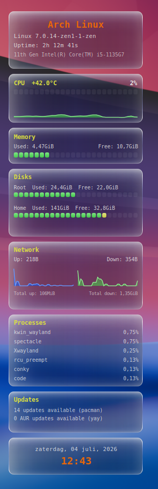

# conky-system (all-Lua rebuild)

A single-file, all-Lua/Cairo system monitor widget for [Conky](https://github.com/brndnmtthws/conky), with a liquid-glass visual style. Built as a from-scratch, minimal-file rewrite of the original TEXT-based `conky-system.conf`.



## Features

- System info: distro name, kernel, uptime, CPU model
- CPU: temperature (via `lm_sensors`), load %, LED-block bar, live history graph
- Memory: used/free, LED-block bar
- Disks: root and home usage, used/free, LED-block bar per disk
- Network: live up/down speed, auto-scaling history graphs, session totals
- Processes: top 6 by CPU usage
- Updates: official repo updates (pacman via `checkupdates`, with an `apt-check` fallback for Debian/Ubuntu) plus an optional AUR line (`yay` or `paru`)
- Date & time

All percentage bars and the CPU graph share one green → yellow → red color language, so CPU/memory/disk load reads consistently at a glance.

## Requirements

- `conky`, built with Lua/Cairo support
- A Cairo-capable Lua binding: `conky_surface()` is used when available (works on both X11 and Wayland); the widget falls back to `cairo_xlib_surface_create()` (via `require("cairo_xlib")`) on older builds
- `ttf-dejavu` (or another monospace font — see `CFG.font` in `widget.lua`)
- `lm_sensors` for the CPU temperature reading (optional — the temperature is simply omitted if `sensors` isn't available)
- `pacman-contrib` for `checkupdates` (Arch/pacman update count)
- `yay` or `paru`, only if you want the AUR updates line
- `lsb_release` for the distro name shown in the first box

## Files

| File | Purpose |
|---|---|
| `conky.conf` | Window/rendering settings; loads `widget.lua` |
| `widget.lua` | Everything else: layout, drawing, data sources, caching |
| `autostart.sh` | Kills any running Conky and (re)starts it with `conky.conf` |

Two files is intentional — everything that can live in Lua does, so there's nothing else to keep in sync.

## Installation

```bash
git clone https://github.com/wim66/conky-system-redone.git ~/.conky/conky-system
cd ~/.conky/conky-system
```

1. Open `widget.lua` and edit the `CFG` table for your machine (see below) — at minimum, set `network_iface`.
2. Run it directly:
   ```bash
   conky -c conky.conf
   ```
   or manage it with [Conky Manager 2](https://github.com/zcot/conky-manager2), or use the included `autostart.sh` to (re)start it, e.g. from your session's autostart.

## Configuration

All settings live at the top of `widget.lua`, in the `CFG` table:

```lua
local CFG = {
    network_iface = "enp0s31f6", -- your network interface, e.g. via `ip a`
    aur_helper = "yay",          -- "yay", "paru", or "" to disable AUR checks
    glass_base_color = 0x08081A, -- base glass tint -- tune per wallpaper
    glass_base_alpha = 0.35,     -- base glass opacity -- tune per wallpaper
    colors = { ... },            -- accent colors used throughout the widget
    ...
}
```

- **`network_iface`**: set this to your active interface (`ip -brief link` or `ip a`).
- **`aur_helper`**: leave as `"yay"`/`"paru"` if installed, or set to `""` to skip the AUR check entirely.
- **`glass_base_color` / `glass_base_alpha`**: the base glass layer is the one most worth re-tuning per wallpaper — darker/more opaque on busy or bright backgrounds, lighter/more transparent on dark ones.
- Box sizes, spacing, and section order live in the `SECTIONS` table near the bottom of the file, if you want to reorder, resize, or drop a section.

## Credits

By [@wim66](https://github.com/wim66), built with [Claude](https://claude.ai).
